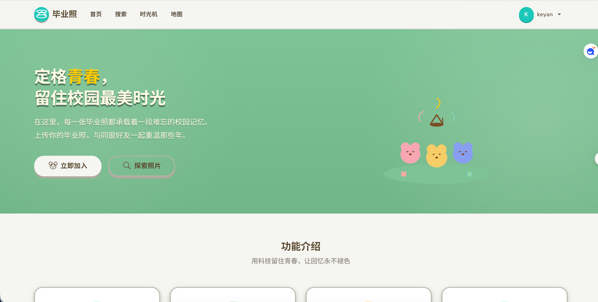

# WEB程序设计大作业

**学院：** 计算机与人工智能学院  
**班级：** 计工本2403  
**学号：** 202411000519  
**姓名：** 靳科研  
**主题：** 基于Servlet与JSP的毕业照管理系统Java Web应用  
**使用技术：** Servlet + JSP + Java Bean + MySQL + Bootstrap 5  

---

## 目录

1 绪论  
1.1 课题背景  
1.2 发展方向  
1.3 研究意义  
1.4 研究内容  
1.5 主要问题  
1.6 本文内容  

2 相关技术  
2.1 Servlet  
2.2 JSP  
2.3 Java Bean  
2.4 MySQL  
2.5 HTML  
2.6 CSS  
2.7 JavaScript  
2.8 Bootstrap 5  
2.9 MVC模式  
2.10 相关技术在系统开发中的作用  
2.11 本章小结  

3 需求分析  
3.1 开发环境  
3.2 数据流图  
3.3 数据字典  
3.3.1 数据结构  
3.3.2 数据流  
3.3.3 数据存储  
3.3.4 处理过程  
3.4 功能需求分析  
3.4.1 用户功能分析  
3.4.2 核心功能分析  
3.5 本章小结  

4 总体设计  
4.1 系统总体功能结构  
4.2 前台功能模块设计  
4.2.1 用户管理模块  
4.2.2 毕业照管理模块  
4.2.3 教育履历模块  
4.2.4 搜索与地图模块  
4.2.5 社交互动模块  
4.3 本章小结  

5 数据库设计  
5.1 简介  
5.2 概念结构设计  
5.2.1 实体属性图  
5.2.2 系统E-R图  
5.3 逻辑结构设计  
5.3.1 关系模式  
5.4 物理结构设计  
5.4.1 详细数据表设计  
5.4.2 数据表关系图  
5.5 本章小结  

6 详细设计  
6.1 界面演示  
6.2 代码演示  

7 总结  

---

## 1 绪论

### 1.1 课题背景

毕业是每个人人生中的重要节点，毕业照承载着青春的记忆和同窗的情谊。然而在信息化时代，传统的纸质毕业照存在诸多不便：容易损坏丢失、难以分享传播、无法与教育履历关联。随着移动互联网和Web技术的普及，越来越多的毕业场景需要数字化呈现。

近年来，基于Java Web的B/S架构应用因其跨平台、易维护、安全性高等优势，成为校园信息化建设的主流技术方案。Servlet + JSP作为Java EE的核心技术，配合MySQL数据库，能够快速搭建功能完善、性能稳定的Web应用。

在此背景下，开发一套基于Servlet与JSP的毕业照管理系统，不仅能够帮助用户集中管理不同教育阶段的毕业照，还能通过地图标记、社交点赞等功能增强互动体验，具有现实的应用价值。

### 1.2 发展方向

随着用户体验需求的提升和Web前端技术的发展，毕业照管理系统的发展方向主要集中在以下几个方面：

第一，**视觉体验升级**。传统的功能型网站逐渐向视觉型、沉浸式体验转变。通过在UI设计中融入游戏化风格（如动物森友会Animal Island UI），使用温暖的色彩体系、圆润的交互元素和生动的SVG图标，显著提升用户的情感体验。

第二，**社交互动增强**。单一的图片存储功能已无法满足用户需求，点赞、时光机回顾、前后对比等社交和趣味功能正成为标配。

第三，**数据分析与展示**。通过对用户上传照片的地理位置、教育阶段、时间分布等数据进行聚合分析和可视化展示，可为用户提供更丰富的个人成长视角。

第四，**移动端适配**。响应式设计和移动优先的开发策略，确保在不同设备上均能获得良好的浏览体验。

### 1.3 研究意义

本次毕业设计选择"基于Servlet与JSP的毕业照管理系统"作为课题，具有以下研究意义：

首先，项目技术栈涉及Java Web开发的完整链路——从前端页面（JSP + HTML + CSS + JavaScript）到后端逻辑（Servlet），再到数据持久层（Java Bean + MySQL），以及Bootstrap响应式布局框架。通过实际开发，可以系统性地掌握Web应用开发的完整流程。

其次，项目功能覆盖了用户认证、文件上传下载、地图API集成、数据库CRUD操作、AJAX异步交互等核心技术，这些是Web开发中最常见、最核心的需求场景。

最后，项目在UI设计上融入了Animal Island UI风格的设计理念——温暖的色彩体系、圆润的交互组件、手绘风格的SVG图标和3D按钮效果。这种设计实践探索了如何在不依赖大型前端框架的前提下，仅通过CSS实现现代设计语言。

### 1.4 研究内容

毕业照管理系统是一个以照片管理为核心、兼具社交互动和教育履历管理功能的Web应用。系统主要包括以下功能模块：

**1）用户注册与登录**  
用户通过注册创建账号，登录后使用系统全部功能。系统使用Session管理用户登录状态，通过AuthFilter对敏感页面进行访问控制。

**2）教育履历管理**  
用户可添加、编辑、删除自己的教育履历，涵盖幼儿园至博士研究生共8个教育阶段。每张毕业照必须关联一条教育履历，实现照片与学历的绑定。

**3）毕业照上传与管理**  
用户上传毕业照（支持JPG/PNG格式，最大10MB），填写标题、描述，并可在地图上选点标记拍摄位置（集成百度地图API）。支持查看照片详情、下载原图和删除照片。

**4）毕业照搜索**  
按教育阶段直接筛选，或通过学校名称、入学年份、班级等关键词模糊搜索。搜索结果以拍立得相框风格的卡片网格展示。

**5）全站地图浏览**  
将所有带有地理坐标的毕业照标记在百度地图上，点击标记可弹出信息窗口查看照片缩略图、标题和元信息，支持缩放和自动定位到最佳视野。

**6）照片点赞**  
登录用户可为任意照片点赞或取消点赞，照片卡片上显示点赞数量。点赞数据通过AJAX异步交互实时更新。

**7）用户头像上传**  
用户可在个人中心上传自定义头像（JPG/PNG，最大5MB），导航栏和个人中心同步显示。

**8）图片灯箱预览**  
点击照片列表中的任意照片，弹出全屏灯箱大图浏览，支持键盘方向键或屏幕按钮左右切换照片。

**9）时光机**  
按入学年份分组浏览毕业照，通过左右箭头轮播不同年份的毕业回忆。

**10）照片对比**  
选择两张不同阶段的毕业照，通过拖拽分割线进行左右对比（如"小学 vs 大学"），直观展示时光变迁。

### 1.5 主要问题

在开发过程中，面临以下主要挑战：

**1）前后端分离协作问题。** JSP页面中嵌入了大量Java代码（Scriptlet），导致业务逻辑与视图层耦合较紧，不利于维护。系统通过将数据库操作封装在DAO层、业务逻辑集中在Servlet层、视图渲染委托给JSP的架构来缓解该问题。

**2）文件上传与安全处理。** 照片和头像上传需要处理文件类型校验、大小限制、UUID重命名、以及安全的磁盘存储路径管理。系统使用Jakarta Servlet的@MultipartConfig注解接收文件，通过MIME类型和扩展名双重校验确保安全性。

**3）百度地图API集成。** 地图组件需要在JSP页面中嵌入百度地图JS SDK，处理坐标选取、标记渲染和信息窗口展示。由于地图数据需要动态加载，系统通过MapServlet提供JSON数据接口，前端通过AJAX获取后渲染标记。

**4）自定义SVG图标系统。** 为匹配Animal Island UI风格，系统设计了完整的SVG图标库（26个自定义图标），包括毕业帽、相机、搜索放大镜、各教育阶段图标和装饰元素。所有图标使用`<symbol>`定义并通过`<use>`引用，确保风格统一且支持CSS继承颜色。

### 1.6 本文内容

本文的组织结构安排如下：

**第一章 绪论：** 从课题背景、发展方向、研究意义、研究内容和主要问题等方面进行介绍；

**第二章 相关技术：** 详细介绍系统开发所使用的核心技术，包括Servlet、JSP、Java Bean、MySQL、Bootstrap 5、JavaScript、CSS，以及MVC设计模式在系统中的应用；

**第三章 需求分析：** 对系统的功能需求、数据流、数据字典进行详细说明；

**第四章 总体设计：** 对系统的总体功能进行模块化分析，分前台后台介绍各模块的设计；

**第五章 数据库设计：** 介绍数据库的概念结构设计（E-R图）、逻辑结构设计和物理结构设计（数据表）；

**第六章 详细设计：** 展示系统的主要界面截图和核心代码逻辑；

**第七章 总结：** 对整个项目的开发过程进行总结，分享经验与收获。

---

## 2 相关技术

### 2.1 Servlet

Servlet是Java EE规范中的核心组件，运行在服务器端（如Tomcat），用于接收和处理客户端HTTP请求，并生成动态响应。在本系统中，Servlet作为控制器（Controller）使用，负责接收表单数据、调用DAO层处理业务逻辑，然后将结果转发给JSP页面渲染。

系统共实现了12个Servlet：

| Servlet | 路由 | 功能 |
|---------|------|------|
| LoginServlet | `/login` | 用户登录验证 |
| RegisterServlet | `/register` | 用户注册 |
| LogoutServlet | `/logout` | 退出登录（清除Session） |
| PhotoUploadServlet | `/photo/upload` | 照片上传 |
| PhotoListServlet | `/photo/list` | 查看我的照片列表 |
| PhotoDetailServlet | `/photo/detail` | 查看照片详情 |
| DeletePhotoServlet | `/photo/delete` | 删除照片 |
| LikeServlet | `/photo/like` | 点赞/取消点赞（AJAX） |
| AvatarUploadServlet | `/avatar/upload` | 用户头像上传 |
| EducationServlet | `/education` | 教育履历增删改查 |
| SearchServlet | `/search/*` | 照片搜索 |
| MapServlet | `/map` | 地图数据接口/页面 |

### 2.2 JSP

JSP（JavaServer Pages）是一种动态网页技术标准，运行在服务器端。它允许在HTML中嵌入Java代码（Scriptlet），简化动态内容的生成。

系统共有16个JSP/JSPF文件：

- **页面层（13个JSP）：** index.jsp（首页）、login.jsp（登录）、register.jsp（注册）、profile.jsp（个人中心）、photo_upload.jsp（上传照片）、photo_list.jsp（照片列表）、photo_detail.jsp（照片详情）、search.jsp（搜索分类）、search_result.jsp（搜索结果）、map.jsp（全站地图）、education_list.jsp（教育履历表）、education_form.jsp（教育履历表单）、timeline.jsp（时光机）、compare.jsp（照片对比）、error.jsp（错误页）。

- **共享组件层（2个JSPF）：** navbar.jsp（导航栏）、icons.jsp（SVG图标库）。

页面采用Bootstrap 5的Grid系统和响应式组件构建布局，自定义CSS实现Animal Island UI设计风格。

### 2.3 Java Bean

Java Bean是遵循特定命名规范的Java类，用于封装数据和业务逻辑。本系统中的Bean类包括：

- **User：** 用户实体，包含id、username、password、avatarPath字段。
- **Photo：** 毕业照实体，包含id、userId、educationId、title、description、imagePath、locationName、longitude、latitude、uploadTime等字段，以及关联查询的username、stage、schoolName、entranceYear、className等展示字段。
- **Education：** 教育履历实体，包含id、userId、stage、schoolName、entranceYear、className等字段。

### 2.4 MySQL

MySQL是当前最流行的开源关系型数据库。系统使用MySQL 5.7存储用户数据、照片数据和点赞记录，通过JDBC（`mysql-connector-j`）驱动连接数据库。数据库连接采用静态工具类`DBUtil`管理，使用try-with-resources确保资源自动释放。

数据库包含4张表：`users`（用户）、`educations`（教育履历）、`photos`（毕业照）、`photo_likes`（点赞记录）。

### 2.5 HTML

HTML是构建Web页面的标准标记语言。系统使用HTML5标准编写所有JSP页面，包括表单（表单验证）、语义化标签和媒体元素。

### 2.6 CSS

CSS用于控制网页的视觉呈现。系统采用CSS变量系统（Design Tokens）统一管理色彩、间距、圆角和阴影等设计规范。主要设计特性包括：

- 温暖大地色系（奶油白背景 #f8f8f0、棕色文字 #794f27、薄荷青绿点缀 #19c8b9）
- 3D按钮效果（底部厚阴影模拟游戏按键，hover上浮，active下压）
- 50px pill形圆角按钮和输入框
- 拍立得风格照片相框（双层阴影 + 内阴影 + 相纸白边）
- 响应式网格布局（Bootstrap Grid + CSS Grid）
- Google Fonts圆体字（Nunito + Noto Sans SC + Zen Maru Gothic）

### 2.7 JavaScript

JavaScript用于实现客户端的交互功能。系统在`main.js`中实现了以下主要功能：

- **灯箱预览：** 点击照片弹出全屏大图，支持键盘和按钮左右切换
- **点赞交互：** 通过AJAX异步请求点赞/取消点赞，实时更新按钮状态和计数
- **照片对比滑块：** 拖拽分割线对比两张不同阶段的毕业照
- **轮播导航：** 时光机页面的年份切换和照片轮播
- **图片上传预览：** 选择照片后即时预览

### 2.8 Bootstrap 5

Bootstrap 5是全球最流行的前端响应式框架。系统通过CDN引入Bootstrap 5.3.0的CSS和JS，利用其网格系统（Grid）、导航栏（Navbar）、卡片（Card）、表单（Form）和下拉菜单（Dropdown）等组件构建页面结构，大幅减少了响应式布局的开发工作量。

### 2.9 MVC模式

MVC（Model-View-Controller）是一种经典的软件架构模式。系统采用了简化的MVC架构：

- **Model（模型）：** Bean类（User、Photo、Education）封装数据结构，DAO类（UserDao、PhotoDao、EducationDao、LikeDao）封装数据库操作
- **View（视图）：** JSP页面负责数据展示和用户交互
- **Controller（控制器）：** Servlet接收请求、调用DAO处理业务、转发到JSP渲染

### 2.10 相关技术在系统开发中的作用

| 系统层次 | 技术 | 作用 |
|---------|------|------|
| 视图层（View） | HTML + CSS + Bootstrap 5 + JavaScript | 页面结构、视觉样式、响应式布局、客户端交互 |
| 控制层（Controller） | Servlet + AuthFilter | 请求路由、业务逻辑处理、权限控制 |
| 模型层（Model） | Java Bean + DAO + JDBC | 数据结构封装、数据库CRUD操作 |
| 数据层 | MySQL | 持久化存储用户、照片、教育履历和点赞数据 |

### 2.11 本章小结

本章介绍了系统开发所使用的核心技术栈，包括Servlet、JSP、Java Bean、MySQL、Bootstrap 5、JavaScript、CSS和MVC模式，并说明了各项技术在系统架构中的具体作用和分工。

---

## 3 需求分析

毕业照管理系统是一个面向校园场景的照片管理与分享平台。系统通过Servlet+JSP+Bootstrap 5+MySQL实现完整的前后端功能，并在UI设计中融入Animal Island UI的温暖设计语言。

### 3.1 开发环境

| 类别 | 环境/工具 | 版本 |
|------|-----------|------|
| 操作系统 | macOS | Sequoia |
| JDK | OpenJDK | 25 |
| Web服务器 | Apache Tomcat | 11.0.21 |
| 数据库 | MySQL | 8.0+ |
| 构建工具 | Maven | 3.9.6 |
| IDE | IntelliJ IDEA / VS Code | - |
| 版本控制 | Git | - |
| 前端框架 | Bootstrap 5 (CDN) | 5.3.0 |

### 3.2 数据流图

用户在访问系统时，首先需要注册或登录。未登录用户可浏览首页、搜索页和地图页（公开访问）；登录用户可以访问个人中心、上传和管理自己的毕业照。

**1）照片上传流程：** 登录用户 → 选择照片文件 → 填写标题和描述 → 关联教育履历 → 地图选点（可选） → 服务器存储文件并录入数据库 → 跳转到照片列表页。

**2）照片搜索流程：** 用户 → 选择教育阶段或输入关键词 → 系统查询数据库 → 返回匹配的照片列表 → 展示为卡片网格。

**3）点赞流程：** 登录用户 → 点击爱心按钮 → AJAX请求LikeServlet → 数据库插入/删除点赞记录 → 返回最新点赞状态和数量 → 前端更新按钮样式和计数。

**4）时光机浏览流程：** 用户 → 选择入学年份 → 系统查询该年度所有毕业照 → 渲染为轮播卡片 → 用户通过箭头切换浏览。

### 3.3 数据字典

#### 3.3.1 数据结构

**数据结构名称：用户表（users）**  
说明：存储用户的基本信息。  
组成：id、username、password、avatar_path

**数据结构名称：教育履历表（educations）**  
说明：存储用户的教育经历记录。  
组成：id、user_id、stage、school_name、entrance_year、class_name

**数据结构名称：毕业照表（photos）**  
说明：存储毕业照的详细信息。  
组成：id、user_id、education_id、title、description、image_path、location_name、longitude、latitude、upload_time

**数据结构名称：点赞表（photo_likes）**  
说明：存储用户对照片的点赞关系。  
组成：user_id、photo_id、created_at

#### 3.3.2 数据流

**数据流名称：用户信息**  
说明：记录用户账号等基本信息。  
来源：注册/登录用户  
去向：users表（登录验证时读取）  
组成：用户id、用户名、密码、头像路径

**数据流名称：毕业照信息**  
说明：记录毕业照相关属性。  
来源：登录用户上传  
去向：photos表  
组成：照片id、标题、描述、文件路径、拍摄位置名称、经纬度、教育履历id、用户id、上传时间

**数据流名称：教育履历信息**  
说明：记录用户的教育经历。  
来源：登录用户创建  
去向：educations表  
组成：履历id、教育阶段、学校名称、入学年份、班级

**数据流名称：点赞信息**  
说明：记录用户对照片的点赞关系。  
来源：登录用户操作  
去向：photo_likes表  
组成：用户id、照片id、点赞时间

#### 3.3.3 数据存储

**数据存储名称：用户信息**  
输入：注册/登录信息  
输出：用户会话数据  
数据结构：用户id、用户名、密码、头像路径

**数据存储名称：毕业照信息**  
输入：上传的照片表单  
输出：照片详情、照片列表、搜索结果  
数据结构：照片id、标题、描述、文件路径、位置信息、关联的教育履历

**数据存储名称：点赞记录**  
输入：点赞/取消点赞操作  
输出：照片点赞数量  
数据结构：用户id、照片id、创建时间

#### 3.3.4 处理过程

**处理过程1：用户注册**  
说明：用户填写注册表单提交注册。  
输入：用户名、密码、确认密码  
处理：校验格式 → 检查用户名唯一性 → 写入users表 → 重定向到登录页  
输出：无

**处理过程2：用户登录**  
说明：用户输入账号密码登录系统。  
输入：用户名、密码  
处理：查询users表校验 → 创建Session → 重定向到个人中心  
输出：登录成功/失败提示

**处理过程3：上传毕业照**  
说明：用户上传毕业照关联教育履历。  
输入：照片文件、标题、描述、教育履历id、位置信息  
处理：校验文件格式和大小 → 生成UUID文件名 → 保存到服务器磁盘 → 写入photos表 → 重定向到照片列表  
输出：上传成功/失败提示

**处理过程4：点赞/取消点赞**  
说明：用户对照片进行点赞或取消。  
输入：用户id、照片id  
处理：查询photo_likes表 → 存在则删除（取消），不存在则插入（点赞） → 返回最新状态  
输出：JSON响应 `{liked: true/false, count: N}`

### 3.4 功能需求分析

#### 3.4.1 用户功能分析

**1）注册 & 登录**  
注册：用户填写用户名（2-20字符）和密码（6-20字符），系统校验格式和唯一性后创建账号。  
登录：注册用户输入用户名和密码，系统验证后创建Session，跳转到个人中心。

**2）个人中心**  
展示用户名、头像、教育履历数量、照片数量；支持头像上传/更换；展示最近上传的6张照片和点赞收藏的6张照片。

**3）教育履历管理**  
用户可添加多个教育阶段的履历记录，支持编辑和删除。每条记录包含教育阶段、学校名称、入学年份和班级信息。

#### 3.4.2 核心功能分析

**1）照片上传**  
用户选择照片文件（JPG/PNG，最大10MB），填写标题和描述，从下拉框中选择关联的教育履历，可选填写拍摄位置名称或在地图上点击选点（集成百度地图API）。提交后系统自动生成UUID文件名保存，并记录地理坐标。

**2）照片浏览与下载**  
我的照片列表以拍立得相框风格的卡片网格展示；点击进入详情页，可查看大图、元信息（教育阶段、学校、年级班级、拍摄位置、上传时间）；支持下载原图。

**3）照片搜索**  
首页提供8个教育阶段分类入口（幼儿园至博士）；搜索结果页支持阶段、学校、年份、班级多字段模糊搜索。

**4）全站地图**  
在地图上展示所有带有地理坐标的毕业照标记，点击标记弹出信息窗口（缩略图+标题+元信息），自动缩放到最佳视野覆盖所有标记。

**5）社交互动**  
照片详情页支持点赞/取消点赞（AJAX异步交互）；点赞数量在照片卡片上展示；个人中心展示用户点赞收藏的照片。

**6）趣味功能**  
时光机按入学年份分组浏览毕业照；照片对比通过拖拽分割线对比两张不同阶段的毕业照。

### 3.5 本章小结

本章对毕业照管理系统的主要功能进行了需求分析，明确了系统的功能目标、数据流、数据字典和用户功能需求，为后续的总体设计和详细设计奠定了基础。

---

## 4 总体设计

### 4.1 系统总体功能结构

毕业照管理系统采用B/S架构，前端通过JSP + Bootstrap 5 + CSS实现视图层，后端通过Servlet + DAO + MySQL实现业务逻辑和数据持久化。系统分为前台（面向普通用户）和后台（管理功能）两大部分。

**前台功能结构：**

```
毕业照管理系统
├── 用户管理
│   ├── 注册
│   ├── 登录/退出
│   ├── 个人中心
│   └── 头像上传
├── 毕业照管理
│   ├── 上传照片（含地图选点）
│   ├── 照片列表（我的/全部）
│   ├── 照片详情
│   ├── 照片删除
│   ├── 照片下载
│   └── 照片灯箱预览
├── 教育履历管理
│   ├── 添加履历
│   ├── 编辑履历
│   ├── 删除履历
│   └── 履历列表
├── 搜索与地图
│   ├── 按阶段搜索
│   ├── 关键词搜索
│   └── 全站地图浏览
├── 社交互动
│   ├── 照片点赞
│   └── 收藏列表
└── 趣味功能
    ├── 时光机（按年份回顾）
    └── 照片对比（Before/After）
```

### 4.2 前台功能模块设计

#### 4.2.1 用户管理模块

用户管理模块负责用户的注册、登录、个人信息维护和头像管理。

- **注册（RegisterServlet）：** 接收用户名、密码和确认密码，进行格式校验和唯一性检查，通过的创建user记录并重定向到登录页。
- **登录（LoginServlet）：** 接收用户名和密码，查询数据库校验，成功后在Session中存储User对象并重定向到个人中心。
- **退出（LogoutServlet）：** 销毁Session并重定向到首页。
- **权限控制（AuthFilter）：** 拦截所有需要登录的URL路径（`/profile.jsp`、`/education/*`、`/photo/*`），检查Session中是否存在User对象，不存在则重定向到登录页。
- **头像上传（AvatarUploadServlet）：** 接收JPG/PNG格式的头像文件（最大5MB），保存到服务器磁盘并更新users表的avatar_path字段。

#### 4.2.2 毕业照管理模块

毕业照管理模块是系统的核心功能，覆盖照片的完整生命周期。

- **上传（PhotoUploadServlet）：** 使用@MultipartConfig注解处理文件上传。接收照片文件、标题、描述、教育履历id、位置名称和经纬度。校验文件格式（MIME和扩展名双重校验），生成UUID文件名，写入数据库，重定向到照片列表页。
- **列表（PhotoListServlet）：** 查询当前用户的所有照片，批量加载每条照片的点赞数量和当前用户的点赞状态，转发到photo_list.jsp渲染为拍立得卡片网格。
- **详情（PhotoDetailServlet）：** 根据照片id查询单条记录（JOIN users和educations表），加载点赞状态，转发到photo_detail.jsp展示大图、元信息和操作按钮（点赞、下载、对比）。
- **删除（DeletePhotoServlet）：** 根据照片id和当前用户id双重校验后删除数据库记录，同时从磁盘删除物理文件。
- **点赞（LikeServlet）：** 接收AJAX POST请求，在photo_likes表中切换点赞状态（存在则删除，不存在则插入），返回JSON格式的点赞状态和最新计数。
- **文件服务（FileServlet）：** 从磁盘读取照片文件并以流的形式返回给客户端，支持图片的在线浏览。

#### 4.2.3 教育履历模块

教育履历是毕业照的必选关联信息，将照片与具体的学习经历绑定。

- **列表（EducationServlet?action=list）：** 查询当前用户的所有教育履历，按id倒序排列，转发到education_list.jsp以表格形式展示。
- **添加/编辑（EducationServlet?action=add/edit）：** 提供包含8个教育阶段下拉框（幼儿园/小学/初中/高中/大学/硕士研究生/博士研究生/其他）、学校名称、入学年份、班级的表单页面。编辑时预填已有数据并校验用户所有权。
- **删除（EducationServlet?action=delete）：** 校验用户所有权后删除记录，级联删除关联的毕业照。

#### 4.2.4 搜索与地图模块

- **搜索页面（search.jsp）：** 以8个NookPhone风格彩色圆形图标卡片展示教育阶段分类，点击直接跳转到对应阶段的搜索结果。
- **搜索结果（search_result.jsp）：** 顶部提供多字段筛选表单（阶段下拉框、学校名称、入学年份、班级文本框），底部展示拍照卡片网格结果。
- **全站地图（map.jsp + MapServlet）：** MapServlet在`?action=data`时返回所有含地理坐标的照片JSON数组；map.jsp使用百度地图JS API加载地图，通过AJAX获取数据后渲染标记，点击标记弹出信息窗口。

#### 4.2.5 社交互动模块

- **时光机（timeline.jsp）：** 按入学年份分组，以水平按钮排列年份选择器，选中年份后在轮播中展示该年度所有毕业照。CSS实现轮播动画和响应式适配。
- **照片对比（compare.jsp）：** 用户通过下拉框选择两张不同阶段的毕业照，页面以CSS的`clip-path`实现分割线效果，通过鼠标或触屏拖拽滑块切换前后两张照片的可见区域，分别标注阶段标签。

### 4.3 本章小结

本章将毕业照管理系统分为五大功能模块——用户管理、毕业照管理、教育履历、搜索地图和社交互动，并对每个模块的子功能进行了详细设计说明，明确了各Servlet的职责和数据流转关系。

---

## 5 数据库设计

### 5.1 简介

数据库设计是系统开发的核心环节。毕业照管理系统采用MySQL关系型数据库，使用InnoDB存储引擎支持外键约束和事务安全。数据库名称为`graduation_photo`，字符集为utf8mb4，连接用户为`graduation_user`。

### 5.2 概念结构设计

#### 5.2.1 实体属性图

**1）用户实体**

用户名
密码
头像路径
用户ID
用户

**2）教育履历实体**

教育阶段
学校名称
履历ID
入学年份
班级
用户ID
教育履历

**3）毕业照实体**

标题
描述
文件路径
照片ID
拍摄位置
经度
纬度
用户ID
教育履历ID
上传时间
毕业照

**4）点赞实体**

用户ID
照片ID
点赞时间
点赞

#### 5.2.2 系统E-R图

系统的主要实体关系如下：

```
1）一个用户可以拥有多条教育履历（1:N）
2）一个用户可以上传多张毕业照（1:N）
3）每张毕业照必须关联一条教育履历（N:1）
4）一个用户可以点赞多张照片，一张照片可以被多个用户点赞（M:N）
```

```
用户 ──1:N──→ 教育履历
  │              │
  │ 1:N          │ 1:N
  │              │
  └──────→ 毕业照 ←──────┘
              │
              M:N
              │
           点赞记录
```

### 5.3 逻辑结构设计

#### 5.3.1 关系模式

**1）实体**

用户（用户id，用户名，密码，头像路径）

教育履历（履历id，用户id，教育阶段，学校名称，入学年份，班级）

毕业照（照片id，用户id，教育履历id，标题，描述，文件路径，拍摄位置名称，经度，纬度，上传时间）

点赞（用户id，照片id，点赞时间）

**2）联系**

拥有_履历（用户，教育履历）  
拥有_照片（用户，毕业照）  
关联（教育履历，毕业照）  
点赞（用户，毕业照）

### 5.4 物理结构设计

#### 5.4.1 详细数据表设计

**1）users 用户表**

| 字段名 | 数据类型 | 是否为空 | 默认值 | 说明 | 备注 |
|--------|---------|---------|--------|------|------|
| id | INT | NO | AUTO_INCREMENT | 用户唯一标识 | 主键 |
| username | VARCHAR(50) | NO | - | 用户名 | 唯一 |
| password | VARCHAR(100) | NO | - | 密码（明文存储） | - |
| avatar_path | VARCHAR(255) | YES | NULL | 头像文件路径 | - |

**2）educations 教育履历表**

| 字段名 | 数据类型 | 是否为空 | 默认值 | 说明 | 备注 |
|--------|---------|---------|--------|------|------|
| id | INT | NO | AUTO_INCREMENT | 履历唯一标识 | 主键 |
| user_id | INT | NO | - | 所属用户 | 外键→users(id)，CASCADE |
| stage | VARCHAR(30) | NO | - | 教育阶段 | 8种预定义值 |
| school_name | VARCHAR(100) | NO | - | 学校名称 | - |
| entrance_year | VARCHAR(20) | YES | NULL | 入学年份 | - |
| class_name | VARCHAR(50) | YES | NULL | 班级名称 | - |

**3）photos 毕业照表**

| 字段名 | 数据类型 | 是否为空 | 默认值 | 说明 | 备注 |
|--------|---------|---------|--------|------|------|
| id | INT | NO | AUTO_INCREMENT | 照片唯一标识 | 主键 |
| user_id | INT | NO | - | 上传用户 | 外键→users(id)，CASCADE |
| education_id | INT | NO | - | 关联教育履历 | 外键→educations(id)，CASCADE |
| title | VARCHAR(100) | YES | NULL | 照片标题 | - |
| description | TEXT | YES | NULL | 照片描述 | - |
| image_path | VARCHAR(255) | NO | - | 文件存储路径 | 相对路径 |
| location_name | VARCHAR(100) | YES | NULL | 拍摄位置名称 | - |
| longitude | DOUBLE | YES | NULL | 百度地图经度 | - |
| latitude | DOUBLE | YES | NULL | 百度地图纬度 | - |
| upload_time | DATETIME | NO | CURRENT_TIMESTAMP | 上传时间 | 自动生成 |

**4）photo_likes 点赞表**

| 字段名 | 数据类型 | 是否为空 | 默认值 | 说明 | 备注 |
|--------|---------|---------|--------|------|------|
| user_id | INT | NO | - | 点赞用户 | 联合主键1，外键→users(id) |
| photo_id | INT | NO | - | 被赞照片 | 联合主键2，外键→photos(id) |
| created_at | TIMESTAMP | NO | CURRENT_TIMESTAMP | 点赞时间 | - |

#### 5.4.2 数据表关系图

```
users (id)
  ├──1:N── educations (user_id)
  │          └──1:N── photos (education_id)
  └──1:N── photos (user_id)
               └── M:N ── photo_likes (user_id, photo_id)
```

### 5.5 本章小结

本章介绍了毕业照管理系统数据库的设计过程，包括概念结构设计（实体属性图和E-R图）、逻辑结构设计（关系模式）和物理结构设计（四张数据表的详细字段定义），明确了表间的外键约束和级联删除策略。

---

## 6 详细设计

### 6.1 界面演示

**1）首页**

首页包含Hero区域（绿色渐变背景 + 毕业庆祝插画 + 注册/探索按钮）、功能介绍区（4个卡片：上传毕业照、搜索同学、地图标记、教育履历）和最新毕业照展示区。采用Animal Island UI温暖的色彩体系、pill形圆角按钮和3D阴影效果。



**2）登录界面**

简洁的居中卡片式表单，包含用户名输入框和密码输入框。输入框采用50px pill形圆角设计，底部有3D阴影模拟游戏按键效果。无多余装饰元素。

**3）注册界面**

与登录界面风格统一，包含用户名、密码和确认密码三个表单字段，附有字符长度要求和格式校验提示。

**4）个人中心**

顶部展示用户信息（自定义头像或字母默认头像）、教育履历数量和照片数量统计；下方为最近上传照片的拍立得相框网格和点赞收藏的照片区域；右上角提供换头像功能。

**5）照片列表**

以CSS Grid网格布局展示当前用户的所有照片，每张照片显示为拍立得相框风格卡片（白色相纸 + 内阴影压痕 + 3D底部阴影 + 圆形删除按钮）。悬停时卡片轻微上浮。

**6）照片详情**

左侧为自适应照片相框（inline-block收缩到照片实际尺寸），右侧为照片元信息（标题、描述、教育阶段、学校、年级班级、拍摄位置、上传时间）、点赞按钮（含计数）和下载原图按钮。

**7）照片上传**

居中卡片式表单，包含标题输入框、描述文本框、文件选择器（带即时预览）、教育履历下拉选择器和名称输入框；下方嵌入百度地图用于点击选取拍摄位置的经纬度坐标。

**8）搜索页面**

以4x2网格展示8个教育阶段的分类入口，每个入口为NookPhone风格的彩色圆形图标 + 文字标签；底部提供"查看全部毕业照"链接。

**9）全站地图**

页面全高度展示百度地图，所有带有地理坐标的毕业照以自定义标记显示；点击标记弹出信息窗口，显示照片缩略图、标题、学校和阶段信息以及"查看详情"链接。

**10）时光机**

绿色渐变Hero区域展示年份选择按钮，选中年份后下方以轮播卡片形式展示该年度所有毕业照。左右箭头按钮控制翻页。

**11）照片对比**

两个下拉框选择不同阶段的毕业照，页面使用CSS clip-path实现可拖拽的分割线效果。鼠标或触屏拖拽中间滑块切换前后两张照片的可见区域。

### 6.2 代码演示

**1）数据库连接工具类**

```java
public class DBUtil {
    private static final String URL = "jdbc:mysql://localhost:3306/graduation_photo"
            + "?useSSL=false&serverTimezone=Asia/Shanghai&allowPublicKeyRetrieval=true";
    private static final String USERNAME = "graduation_user";
    private static final String PASSWORD = "***";
    private static final String DRIVER = "com.mysql.cj.jdbc.Driver";

    static {
        try {
            Class.forName(DRIVER);
        } catch (ClassNotFoundException e) {
            throw new RuntimeException("MySQL驱动加载失败", e);
        }
    }

    public static Connection getConnection() throws SQLException {
        return DriverManager.getConnection(URL, USERNAME, PASSWORD);
    }

    public static void close(AutoCloseable... resources) {
        for (AutoCloseable resource : resources) {
            if (resource != null) {
                try { resource.close(); } catch (Exception e) { e.printStackTrace(); }
            }
        }
    }
}
```

**2）照片搜索DAO**

```java
public List<Photo> searchPhotos(String stage, String schoolName,
        String entranceYear, String className) {
    List<Photo> list = new ArrayList<>();
    StringBuilder sql = new StringBuilder(
        "SELECT p.*, u.username, e.stage, e.school_name, " +
        "e.entrance_year, e.class_name " +
        "FROM photos p JOIN users u ON p.user_id = u.id " +
        "JOIN educations e ON p.education_id = e.id WHERE 1=1"
    );
    List<Object> params = new ArrayList<>();

    if (stage != null && !stage.isEmpty()) {
        sql.append(" AND e.stage = ?");
        params.add(stage);
    }
    if (schoolName != null && !schoolName.isEmpty()) {
        sql.append(" AND e.school_name LIKE ?");
        params.add("%" + schoolName + "%");
    }
    // ... 其他条件
    sql.append(" ORDER BY p.upload_time DESC");

    try (Connection conn = DBUtil.getConnection();
         PreparedStatement ps = conn.prepareStatement(sql.toString())) {
        for (int i = 0; i < params.size(); i++) {
            ps.setObject(i + 1, params.get(i));
        }
        ResultSet rs = ps.executeQuery();
        while (rs.next()) {
            list.add(mapResultSet(rs));
        }
    } catch (SQLException e) { e.printStackTrace(); }
    return list;
}
```

**3）点赞Servlet（AJAX接口）**

```java
@WebServlet("/photo/like")
public class LikeServlet extends HttpServlet {
    @Override
    protected void doPost(HttpServletRequest req, HttpServletResponse resp)
            throws IOException {
        HttpSession session = req.getSession(false);
        if (session == null || session.getAttribute("user") == null) {
            resp.sendError(HttpServletResponse.SC_UNAUTHORIZED);
            return;
        }

        User user = (User) session.getAttribute("user");
        int photoId = Integer.parseInt(req.getParameter("photoId"));
        LikeDao likeDao = new LikeDao();
        Map<String, Object> result = likeDao.toggleLike(user.getId(), photoId);

        resp.setContentType("application/json;charset=UTF-8");
        resp.getWriter().write(String.format(
            "{\"liked\":%b,\"count\":%d}",
            result.get("liked"), result.get("count")
        ));
    }
}
```

**4）照片前/后对比滑块（JavaScript）**

```javascript
var container = document.getElementById('compareContainer');
var slider = document.getElementById('compareSlider');
var after = document.getElementById('compareAfter');
var dragging = false;

function setSplit(x) {
  var rect = container.getBoundingClientRect();
  var percent = Math.max(5, Math.min(95, ((x - rect.left) / rect.width) * 100));
  after.style.clipPath = 'inset(0 0 0 ' + percent + '%)';
  slider.style.left = percent + '%';
}

slider.addEventListener('mousedown', function(e) {
  e.preventDefault();
  dragging = true;
});

container.addEventListener('mousemove', function(e) {
  if (!dragging) return;
  setSplit(e.clientX);
});
```

**5）登录验证Servlet**

```java
@WebServlet("/login")
public class LoginServlet extends HttpServlet {
    private final UserDao userDao = new UserDao();

    @Override
    protected void doPost(HttpServletRequest req, HttpServletResponse resp)
            throws ServletException, IOException {
        String username = req.getParameter("username");
        String password = req.getParameter("password");

        if (username == null || password == null ||
                username.trim().isEmpty() || password.trim().isEmpty()) {
            req.setAttribute("error", "用户名和密码不能为空");
            req.getRequestDispatcher("/login.jsp").forward(req, resp);
            return;
        }

        User user = userDao.findByUsername(username);
        if (user != null && user.getPassword().equals(password)) {
            req.getSession().setAttribute("user", user);
            resp.sendRedirect(req.getContextPath() + "/profile.jsp");
        } else {
            req.setAttribute("error", "用户名或密码错误");
            req.getRequestDispatcher("/login.jsp").forward(req, resp);
        }
    }
}
```

**6）照片文件上传Servlet**

```java
@WebServlet("/photo/upload")
@MultipartConfig(maxFileSize = 30 * 1024 * 1024)
public class PhotoUploadServlet extends HttpServlet {
    @Override
    protected void doPost(HttpServletRequest req, HttpServletResponse resp)
            throws ServletException, IOException {
        // 获取表单数据
        String title = req.getParameter("title");
        String educationIdStr = req.getParameter("educationId");
        Part filePart = req.getPart("photoFile");

        // 校验文件格式
        String contentType = filePart.getContentType();
        if (!"image/jpeg".equals(contentType) && !"image/png".equals(contentType)) {
            req.setAttribute("error", "仅支持JPG和PNG格式");
            req.getRequestDispatcher("/photo_upload.jsp").forward(req, resp);
            return;
        }

        // 生成UUID文件名
        String ext = ".jpg";
        String submittedFileName = filePart.getSubmittedFileName();
        if (submittedFileName != null && submittedFileName.contains(".")) {
            ext = submittedFileName.substring(submittedFileName.lastIndexOf("."));
        }
        String newFileName = UUID.randomUUID().toString() + ext;

        // 保存到磁盘
        File dir = new File(UPLOAD_DIR);
        if (!dir.exists()) dir.mkdirs();
        Path filePath = Paths.get(UPLOAD_DIR, newFileName);
        Files.copy(filePart.getInputStream(), filePath);

        // 录入数据库
        Photo photo = new Photo();
        photo.setUserId(user.getId());
        photo.setEducationId(Integer.parseInt(educationIdStr));
        photo.setTitle(title);
        photo.setImagePath("uploads/" + newFileName);
        // ... 设置其他字段
        photoDao.addPhoto(photo);

        resp.sendRedirect(req.getContextPath() + "/photo/list");
    }
}
```

---

## 7 总结

通过这次WEB程序设计大作业，我系统地实践了Java Web开发的完整技术栈，从需求分析、数据库设计到前后端编码和部署上线。

项目的技术亮点包括：

1. **完整的技术架构**：采用Servlet + JSP + Java Bean + MySQL的经典组合，实现了MVC分层的Web应用架构。使用AuthFilter进行权限控制，FileServlet处理静态文件服务，DAO层封装所有数据库操作。

2. **丰富的功能实现**：在基本的照片CRUD功能基础上，扩展了教育履历管理、百度地图集成、点赞互动、时光机回顾、照片对比等10+个功能模块。

3. **持续迭代的设计实践**：经历了从"青春校园风"到"Animal Island UI风格"的设计转型过程，沉淀了一套完整的CSS Design Token系统和26个自定义SVG图标库。拍立得相框设计、自适应照片展示、游戏化3D按钮等细节提升了用户体验。

4. **前端交互创新**：通过原生JavaScript实现了灯箱预览、点赞AJAX交互、分割线拖拽对比等多个交互组件，未依赖jQuery等第三方库。

在开发过程中，也遇到了一些挑战：JSP页面中业务逻辑与视图代码的耦合问题、文件上传安全处理、以及如何在不使用前端框架的前提下实现复杂的交互效果。通过与同学的交流和查阅资料，这些问题都得到了有效解决。

此次项目让我深刻体会到，Web开发不仅仅是编写代码，更是对用户体验、系统架构、代码质量的全面考量。掌握一项技术的最好方式，就是在实际项目中反复实践。感谢柴慧敏老师在课程中的指导，也感谢在项目开发过程中给予帮助的同学们。
